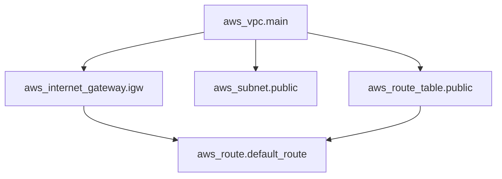

# Resource Graph


## Example Code

```hcl

resource "aws_vpc" "main" {
  cidr_block = "10.0.0.0/16"
}

resource "aws_internet_gateway" "igw" {
  vpc_id = aws_vpc.main.id
}

resource "aws_subnet" "public" {
  vpc_id     = aws_vpc.main.id
  cidr_block = "10.0.1.0/24"
}

resource "aws_route_table" "public" {
  vpc_id = aws_vpc.main.id
}

```



